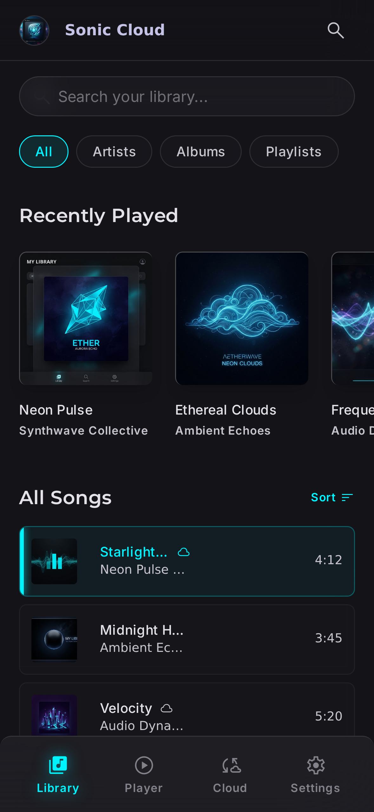
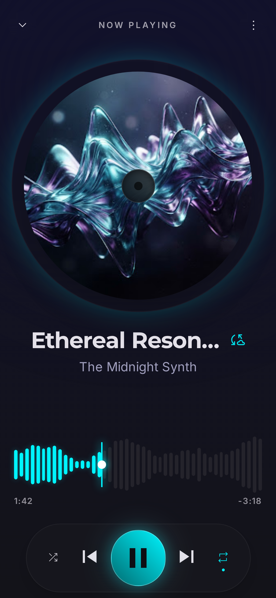
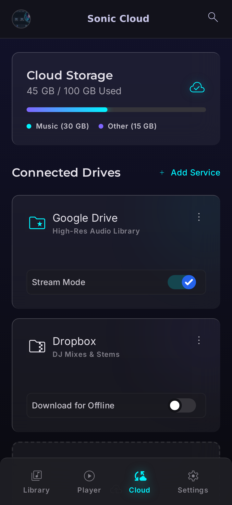
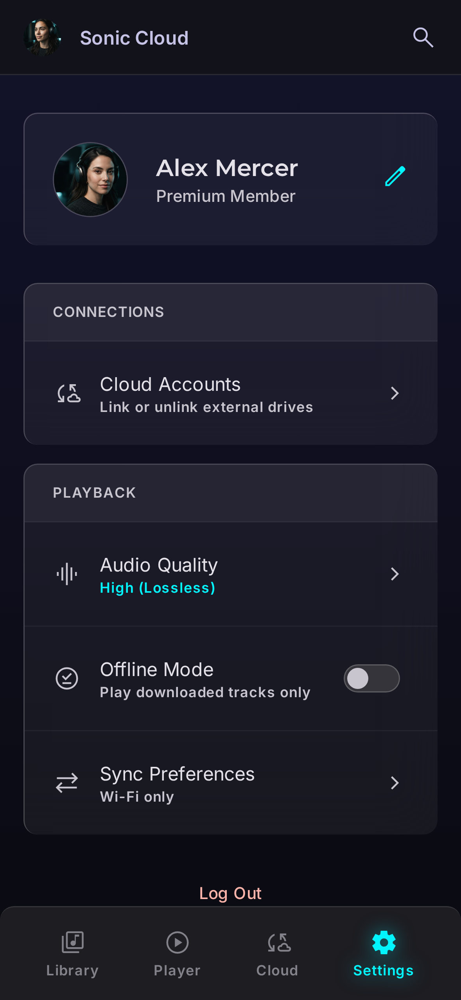

# Sonic Cloud

<p align="center">
  
</p>

<p align="center">
  <strong>A premium glassmorphic music player with cloud integration.</strong><br/>
  Built with Flutter. Implements the Sonic Cloud design system across four screens.
</p>

<p align="center">
  <a href="https://flutter.dev"></a>
  <a href="https://dart.dev"></a>
  
  
  
</p>

---

## Screenshots

<p align="center">
  
  
  
  
</p>

<p align="center"><em>Left to right: My Library · Now Playing · Cloud Storage · Settings</em></p>

> The screenshots above are renderings of the design-system HTML mockups that
> this Flutter app implements 1:1. Each screen reproduces the same glassmorphic
> cards, sonic-seeker progress bar, vinyl-style Now Playing view, and vibrant
> cyan accents.

---

## Features

- 🎨 **Design-system-driven** — every color, typography token, spacing step,
  and radius comes from `sonic_cloud.md`. The HTML analysis found radius
  tokens halved in the original Tailwind config; this port restores them.
- 🟦 **Glassmorphism** — translucent cards with `BackdropFilter` blur and
  light-edge borders, exactly per spec.
- 🌊 **Sonic Seeker** — a 45-bar waveform seek bar with drag-to-seek and a
  glowing playhead thumb.
- 🎵 **Real audio playback** — powered by `just_audio`, with a bundled sample
  WAV so playback works offline. Just press play.
- 📱 **Six platforms** — Android, iOS, macOS, Linux, Windows, and web from a
  single codebase.
- 🧪 **Tested** — widget tests for the core reusable components plus a
  `PlaybackService` unit test.

---

## Project structure

```
sonic_cloud_flutter/
├── lib/
│   ├── main.dart                      ← entry + bottom-nav shell + ambient bg
│   ├── theme/
│   │   ├── app_colors.dart            ← full Material-3 palette from YAML
│   │   ├── app_typography.dart        ← Montserrat (headlines) + Inter (body/labels)
│   │   ├── app_spacing.dart           ← 4px scale + corrected radius tokens
│   │   └── app_theme.dart             ← ThemeData.dark() wired to tokens
│   ├── services/
│   │   └── playback_service.dart      ← just_audio wrapper (ChangeNotifier)
│   ├── models/
│   │   └── models.dart                ← Track, Album, CloudDrive, etc.
│   ├── data/
│   │   └── mock_data.dart             ← in-memory content for all screens
│   ├── widgets/
│   │   ├── glass_card.dart            ← GlassCard + AmbientBackground
│   │   ├── sonic_glow_button.dart     ← pulsing cyan play button
│   │   ├── waveform_progress.dart     ← 45-bar waveform seek bar
│   │   ├── top_app_bar.dart           ← glass top app bar
│   │   ├── bottom_nav_bar.dart        ← glass bottom nav w/ active glow
│   │   ├── album_card.dart            ← carousel card
│   │   └── track_row.dart             ← song list row w/ pulse animation
│   └── screens/
│       ├── my_library_screen.dart     ← Home: search, chips, carousel, song list
│       ├── now_playing_screen.dart    ← Vinyl art + waveform + controls
│       ├── cloud_storage_screen.dart  ← Storage, drives, sync activity
│       └── settings_screen.dart       ← Profile, connections, playback
├── test/
│   ├── app_smoke_test.dart            ← end-to-end smoke test
│   ├── glass_card_test.dart
│   ├── waveform_progress_test.dart
│   ├── sonic_glow_button_test.dart
│   ├── track_row_test.dart
│   └── playback_service_test.dart     ← unit test with mocktail
├── assets/
│   ├── icon/icon.png                  ← source launcher icon (1024×1024)
│   └── audio/sample_track.wav         ← bundled demo audio
├── screenshots/                       ← design-system reference renders
├── android/ ios/ macos/ linux/ windows/ web/   ← platform runners
└── pubspec.yaml
```

---

## Getting started

### Prerequisites

- Flutter ≥ 3.10
- Dart ≥ 3.0

### Install & run

```bash
git clone https://github.com/Exon101/sonic-cloud-flutter.git
cd sonic-cloud-flutter
flutter pub get
flutter run
```

Pick a target with `flutter run -d <device>`. Use `flutter devices` to list
available targets.

### Regenerate launcher icons

```bash
dart run flutter_launcher_icons
```

This regenerates `android/app/src/main/res/mipmap-*/`, `ios/Runner/Assets.xcassets/AppIcon.appiconset/`, `web/icons/`, `macos/Runner/Assets.xcassets/AppIcon.appiconset/`, and `windows/runner/resources/app_icon.ico` from the source PNG at `assets/icon/icon.png`.

### Run the tests

```bash
flutter test
```

The suite includes:
- `glass_card_test.dart` — child rendering, tap handling, custom radius
- `waveform_progress_test.dart` — boundary progress values, tap-to-seek, drag-to-seek
- `sonic_glow_button_test.dart` — play/pause icon state, tap, custom size
- `track_row_test.dart` — title/artist rendering, cloud badge, active state, taps
- `playback_service_test.dart` — unit tests with a mocked `AudioPlayer` (mocktail)
- `app_smoke_test.dart` — full app smoke test that navigates between all four screens

---

## How the audio is wired

The [PlaybackService](lib/services/playback_service.dart) is a thin
`ChangeNotifier` wrapper around `just_audio`'s `AudioPlayer`:

```
PlaybackService  ←──  widgets listen via AnimatedBuilder(animation: service)
   │
   ├─ load(url)              ─→ AudioPlayer.setUrl(...)
   ├─ play() / pause()       ─→ AudioPlayer.play() / pause()
   ├─ seekToProgress(0..1)   ─→ AudioPlayer.seek(Duration)
   └─ notifies listeners on every position / state change
```

- A single `PlaybackService` instance lives in `_HomeShellState` and is
  injected into `NowPlayingScreen` via the constructor.
- `NowPlayingScreen` rebuilds via `AnimatedBuilder(animation: widget.playback, ...)`
  so the waveform, timestamps, and play/pause icon all stay in sync.
- The bundled sample WAV at `assets/audio/sample_track.wav` is loaded as an
  `asset://` URL — playback works fully offline. To use real audio, replace
  `Track.audioUrl` with a network URL.

---

## Design system fidelity

| Token family   | Status | Notes                                                                 |
| -------------- | ------ | --------------------------------------------------------------------- |
| Colors         | ✅ exact | Every Material-3 surface/primary/secondary/tertiary/error variant     |
| Typography     | ✅ exact | Montserrat 600/700 headlines, Inter 400/500/600 body/labels           |
| Spacing        | ✅ exact | 4px base scale, edge-margin 20px, gutter 16px                         |
| Radius         | ✅ fixed | HTML had every radius halved; Flutter uses spec values (lg=16px, xl=24px) |
| Glassmorphism  | ✅      | `BackdropFilter(blur 20)` + 5% white fill + 1px top/left light edge   |
| Sonic glow     | ✅      | Drop-shadow on active nav icons, pulsing outer glow on play button    |

### Screen-level fixes from the original HTML analysis

1. **Settings desktop view** — HTML had a placeholder; this port uses one responsive layout.
2. **Album art radius** — Correctly 16px (`rounded-lg`), not 8px.
3. **Toggles are accessible** — Each toggle has a visible label and a `GestureDetector`.
4. **No duplicate stylesheets** — Single source of truth in `app_theme.dart`.
5. **Bottom nav doesn't appear on Now Playing** — Pushed as a full-screen route.

---

## Built with

- [Flutter](https://flutter.dev) — UI toolkit
- [google_fonts](https://pub.dev/packages/google_fonts) — Montserrat + Inter
- [just_audio](https://pub.dev/packages/just_audio) — audio playback
- [flutter_launcher_icons](https://pub.dev/packages/flutter_launcher_icons) — icon generation
- [mocktail](https://pub.dev/packages/mocktail) — test mocks

---

## License

MIT — feel free to fork and adapt.
